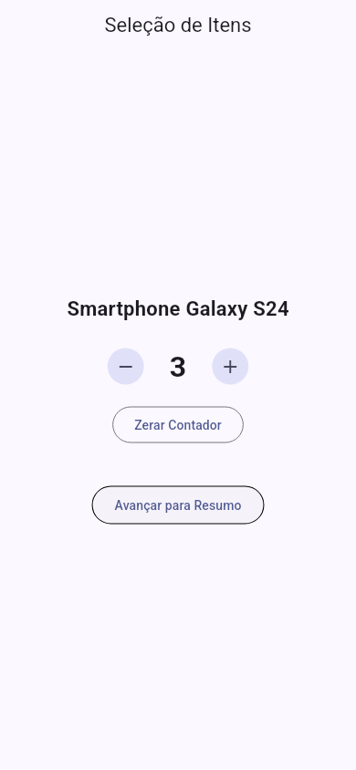
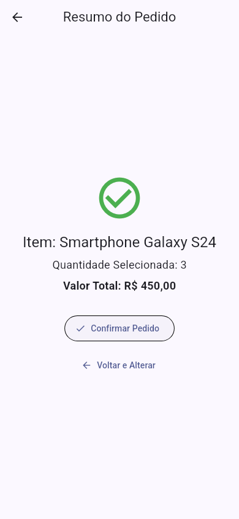

# Aula 7 — Gerenciamento de Estado Local e Navegação

Aplicativo Flutter de checkout desenvolvido para a disciplina **Programação para Dispositivos Móveis I**. O projeto demonstra gerenciamento de estado local com `StatefulWidget` e `setState`, navegação entre telas e passagem de dados pelo construtor.

## Funcionalidades

- seleção da quantidade do produto **Smartphone Galaxy S24**;
- incremento e decremento, com quantidade mínima igual a `1`;
- botão **Zerar Contador** para redefinir a quantidade;
- cálculo do pedido pelo preço unitário de **R$ 150,00**;
- envio do produto, da quantidade e do valor total para a TelaResumo;
- retorno da TelaResumo pela pilha do `Navigator`;
- confirmação do pedido com retorno booleano e exibição de `SnackBar`.

## Estrutura principal

| Arquivo | Widget | Responsabilidade |
| --- | --- | --- |
| `lib/main.dart` | `TelaContador` (`StatefulWidget`) | Mantém o estado da quantidade, calcula o total e abre o resumo. |
| `lib/tela_resumo.dart` | `TelaResumo` (`StatelessWidget`) | Exibe os dados recebidos e devolve o resultado da confirmação. |
| `test/widget_test.dart` | Testes de widget | Valida contador, navegação, passagem de dados e confirmação. |
| `tool/evidencias_test.dart` | Teste visual | Renderiza as telas usadas como evidências da atividade. |

## Como executar

### Pré-requisitos

- Flutter no canal estável;
- um emulador Android, dispositivo físico ou navegador compatível configurado.

### Comandos

```bash
flutter pub get
flutter analyze
flutter test
flutter run
```

Para selecionar explicitamente um dispositivo, liste os disponíveis e informe o identificador desejado:

```bash
flutter devices
flutter run -d ID_DO_DISPOSITIVO
```

## Fluxo para validação manual

1. Inicie o aplicativo e confirme que o contador começa em `1`.
2. Toque duas vezes no botão `+`; o contador deverá mostrar `3`.
3. Toque em **Avançar para Resumo**.
4. Confirme na TelaResumo:
   - `Item: Smartphone Galaxy S24`;
   - `Quantidade Selecionada: 3`;
   - `Valor Total: R$ 450,00`.
5. Toque em **Confirmar Pedido**.
6. Confirme o retorno à TelaContador e a mensagem **Pedido Confirmado com Sucesso!**.

## Evidências

As instruções detalhadas e as imagens geradas pelo teste visual ficam em [`docs/evidencias`](docs/evidencias). O workflow **Flutter CI** também disponibiliza as imagens no artefato `evidencias-telas`.

### TelaContador após alteração da quantidade



### TelaResumo com os dados recebidos



Para gerar novamente as evidências em um ambiente com Flutter:

```bash
flutter test tool/evidencias_test.dart --update-goldens
```

## Validação automatizada

A cada `push` ou pull request, o workflow [Flutter CI](.github/workflows/flutter.yml) executa:

1. instalação das dependências;
2. `flutter analyze`;
3. `flutter test`;
4. geração das evidências visuais;
5. `flutter build web`.
